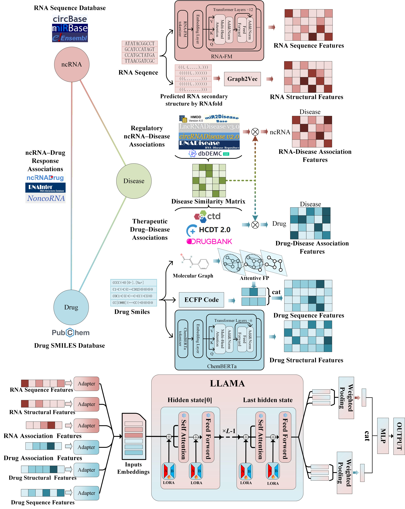

# NCRDLLM

[English](README.md) | **简体中文**

## 欢迎使用 NCRDLLM

NCRDLLM（基于大语言模型的 ncRNA–药物响应关联预测）是一个统一框架，用于预测三类非编码 RNA
（circRNA、miRNA、lncRNA）与药物之间的关联。模型构建了三组多模态特征——由预训练基础模型 RNA-FM 与
ChemBERTa 提取的序列特征、来自 RNA 二级结构图与药物指纹/图表示的结构特征、以及由疾病关联网络编码得到的
关联特征——并通过适配器（adapter）模块将其映射到 **LLaMA-3.2-3B** 的隐空间，再用 **LoRA** 进行参数高效
微调。NCRDLLM 在 miRNA-drug、lncRNA-drug、circRNA-drug 三个数据集上分别取得 0.9636、0.9662、0.9616 的
AUC-ROC。

NCRDLLM 的整体流程图如下：



## 目录结构

```
├── NCRDLLM
│   ├── data                                   # 三类 ncRNA 的数据集
│   │   ├── miRNA-drug
│   │   │   ├── Features_RNAFM_RNA_640D.xlsx    # RNA 序列特征 (640D)，ID 列：RNA_ID
│   │   │   ├── secondary_feature_RNA.xlsx      # RNA 结构特征 (128D)，ID 列：RNA_ID
│   │   │   ├── onehot_RNA_matrix.xlsx          # RNA 疾病关联特征 (1690D)，ID 列：RNA_ID
│   │   │   ├── Features_ChemBERTa_Drug_768D.xlsx  # 药物序列特征 (768D)，ID 列：CID
│   │   │   ├── ALLdrug-graph-features.xlsx     # 药物图特征 (512D)，ID 列：CID
│   │   │   ├── ALLdrug-ECFP-features.xlsx      # 药物 ECFP 指纹 (512D)，ID 列：CID
│   │   │   ├── onehot_Drug_matrix.xlsx         # 药物疾病关联特征 (1690D)，ID 列：CID
│   │   │   ├── responsed_RNA-drug.xlsx         # ncRNA-药物正样本对，列：RNA_ID, CID
│   │   │   └── splits                          # 自动生成的 5 折划分缓存 (.pkl)
│   │   ├── lncRNA-drug                         # 文件结构同 miRNA-drug
│   │   └── circRNA-drug                        # 文件结构同 miRNA-drug
│   ├── download_model.py                       # 一键下载 LLaMA-3.2-3B 权重
│   ├── config.py                               # 全局配置
│   ├── args_parser.py                          # 命令行参数解析
│   ├── dataset.py                              # 特征加载、负采样、K 折划分
│   ├── model.py                                # FeatureAdapter / WeightedPooling / MultimodalLLM
│   ├── utils.py                                # 指标、随机种子、早停
│   ├── export_utils.py                         # 特征 / 预测 / 权重导出
│   ├── visualize.py                            # ROC / PR / t-SNE 绘图
│   └── train.py                                # 训练主程序（5 折交叉验证）
├── row                                         # 数据预处理脚本（仅供参考，见下文）
└── README.md
```

每次运行的结果保存在 `NCRDLLM/results/exp_<时间戳>/`，包含各折预测、ROC/PR 曲线与交叉验证汇总。

## 安装与环境

NCRDLLM 在 Python 3.10 + 支持 CUDA 的 GPU 环境下测试通过。建议使用 conda 虚拟环境。推荐的库版本如下：

```
├── torch              2.1.1
├── transformers       4.45.2
├── peft               0.13.0
├── modelscope         1.18.0
├── scikit-learn       1.3.2
├── pandas             2.0.3
├── openpyxl           3.1.2
├── matplotlib         3.7.5
└── tqdm               4.66.1
```

### 第一步：下载代码与数据

使用以下命令克隆本项目，或点击右上角 “Code” 下载 zip 包。三个数据集的多模态特征数据已随仓库提供。

```bash
git clone https://github.com/ProZhang-Gr/NCRDLLM.git
```

### 第二步：下载模型权重

模型只读取本地 LLM 权重、不会自动联网下载，因此需要先把权重下下来。仓库提供了一键下载脚本，它会把权重放到
代码默认查找的正确位置（无需任何手动配置）：

```bash
cd NCRDLLM/NCRDLLM
pip install modelscope
python download_model.py
```

权重（LLaMA-3.2-3B-Instruct，数 GB，支持断点续传）会保存到
`NCRDLLM/NCRDLLM/llama3.1/LLM-Research/Llama-3___2-3B-Instruct/`，正是 `train.py` 查找的路径。

### 第三步：运行模型

在虚拟环境中运行主程序：

```bash
python train.py \
  --dataset miRNA-drug \
  --use_rna_seq --use_rna_struct --use_rna_disease \
  --use_drug_seq --use_drug_struct --use_drug_disease \
  --use_lora --lora_r 64 --lora_alpha 64
```

切换数据集时，把 `--dataset` 改为 `lncRNA-drug` 或 `circRNA-drug`。所有运行结果会保存在 `results` 目录下。

## 顺利运行的小贴士

帮助你第一次就能顺利跑起来的几点提示：

- 🗂️ **在 `NCRDLLM/NCRDLLM/` 目录里运行**（即 `train.py` 所在文件夹）。`download_model.py` 和 `train.py`
  都从这里启动，相对路径会自动对上。
- 📋 **运行命令直接照抄即可。** 那些 `--use_*` 开关和 `--lora_r 64 --lora_alpha 64` 是标准配置，全部保留是
  复现论文结果最省心的方式。
- 🖥️ **需要一块支持 CUDA 的 GPU。** 显存 16 GB 左右比较从容；若遇到显存不足（OOM），在命令后加上
  `--batch_size 32`（或 `16`）即可。
- ⏳ **第一次运行启动会稍慢。** 训练开始前会先构建并缓存交叉验证划分，开头安静地停顿一下属于正常现象，
  稍等片刻即可。
- 🔍 **看到 `未找到本地模型 / model not found`？** 说明跳过了第二步——先运行 `python download_model.py`
  即可。
- 📁 **结果在哪里？** 运行结束后到 `results/exp_<时间戳>/` 查看预测结果、ROC/PR 曲线与交叉验证汇总。

其余部分开箱即用，祝实验顺利！🎉

## 数据预处理（仅供参考）

`row/` 目录存放的是构建多模态特征所用的**数据预处理脚本**，**仅供学习与参考**。原始数据与中间结果体积很大，
**未**包含在仓库中；运行最终模型**不需要**这个目录——可直接使用的特征文件已放在 `NCRDLLM/data/` 下。

## 引用

如果本工具与代码对你有帮助，欢迎引用我们的论文并 star 项目以示支持，谢谢！

引用格式：

Zihan Zhang, Yuchen Zhang\*, "NCRDLLM: Predicting ncRNA-Drug Response Associations via Multimodal Feature
Fusion and Large Language Models," *Journal of Chemical Information and Modeling*, 2026, online.
DOI: 10.1021/acs.jcim.5c03011.（SCI，2026 新锐分区二区，Top 期刊，JCR Q1，IF: 5.30）
```
